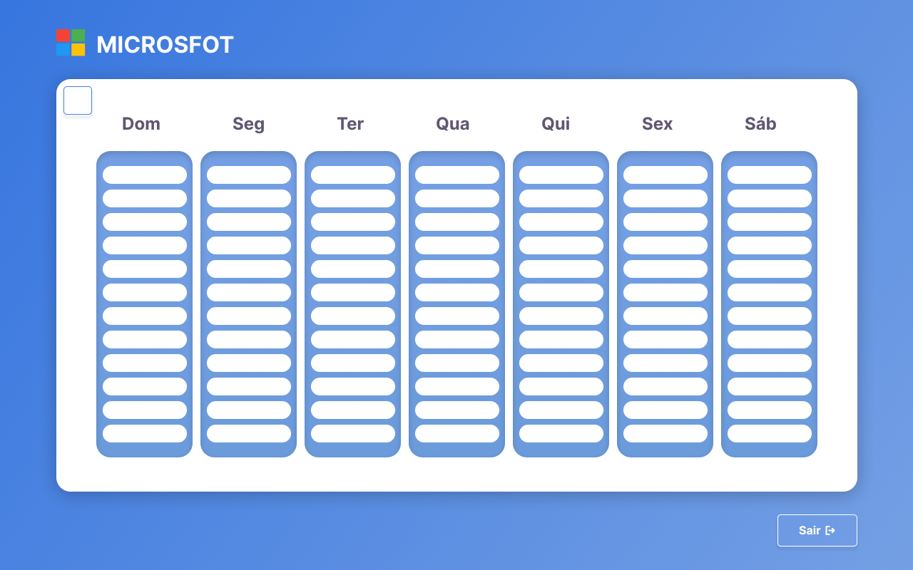

# [PLANNER - PROJETO INTEGRADOR] 

  

  

## Índice
* [Introdução](#%EF%B8%8F-introdução)
* [Tecnologias utilizadas](#%EF%B8%8F-tecnologias-utilizadas)
* [Ferramentas utilizadas](#%EF%B8%8F-ferramentas-utilizadas)
* [Serviços utilizados](#-serviços-utilizados)
* [Funcionalidades do projeto](#-funcionalidades-do-projeto)
* [Acesso ao projeto](#-acesso-ao-projeto)
* [Autor(es)](#-autores)
* [Contato](#%EF%B8%8F-contato)

## ⚙️ Introdução 
O sistema Cacicada é um projeto multidiciplinar que envolve as matérias de Linguagem de programação, Programação orientada a Objetos, Banco de dados de Fundamentos de análises de sistema. O objetivo é a criação de um planner de agendamentos de atividades para a organização pessoal.  

## 🖥️ Tecnologias utilizadas

- ``Python``
- ``Tkinter``
- ``Sqlite``

## 🛠️ Ferramentas utilizadas

- ``Figma``
- ``Lucid Chart``
- ``MySql Workbench``
- ``Replit``
- ``PyCharm``
- ``Visual Studio Code``

## 🧰 Serviços utilizados

- ``Github``

## 🪚 Funcionalidades do projeto

- ``Funcionalidade 1:`` Sistema de cadastro ao usuário
- ``Funcionalidade 2:`` Sistema de login ao usuário
- ``Funcionalidade 3:`` Sistema de recuperação de senha
- ``Funcionalidade 4:`` Criação de eventos
- ``Funcionalidade 5:`` Edição de eventos
- ``Funcionalidade 6:`` Exclusão de eventos

## 📂 Acesso ao projeto

Você pode acessar o projeto [baixando o projeto](https://github.com/gustavotht21/planner-cacicada-python/archive/refs/heads/main.zip) e iniciando-o na IDE de sua preferência, onde quando executado irá abrir no navegador o projeto funcionando

## 👤 Autor(es)

|         [ Gustavo Casagrande Borges](https://github.com/gustavotht21)         |
|:---:|
| [ Wata Negreiros Monteiro](https://github.com/WataNegreirosMonteiro) |

## ✉️ Contato

Entre em contato via e-mail: 
* borges.gustavo@estudante.ifro.edu.br
* wata.negreiros@estudante.ifro.edu.br
